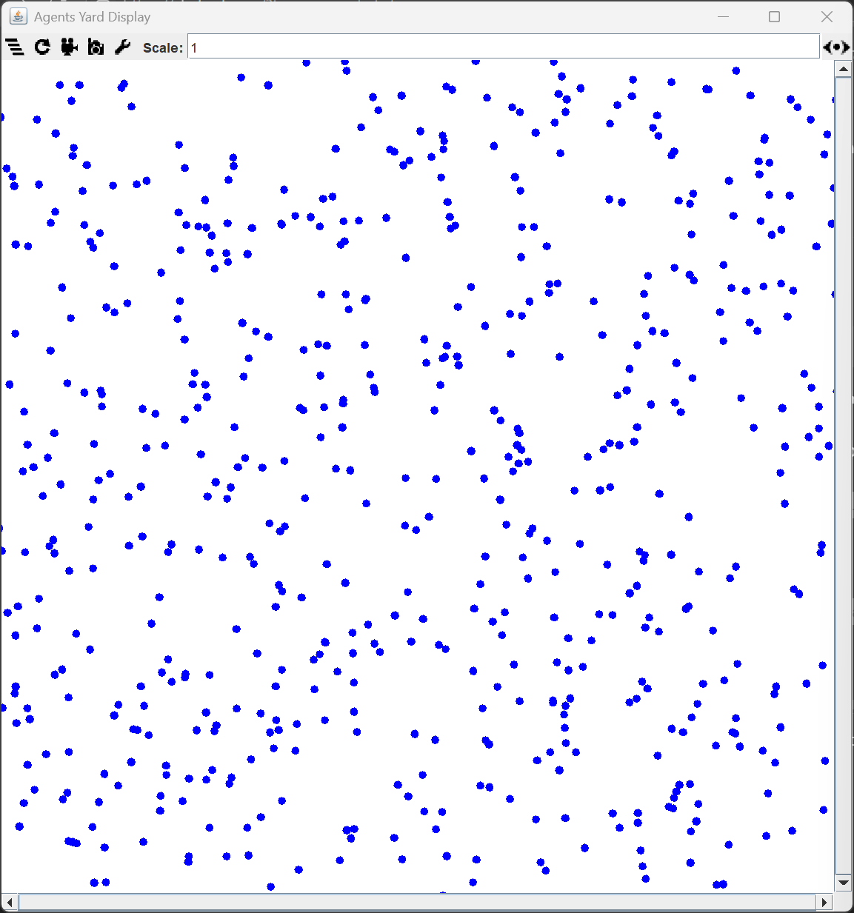
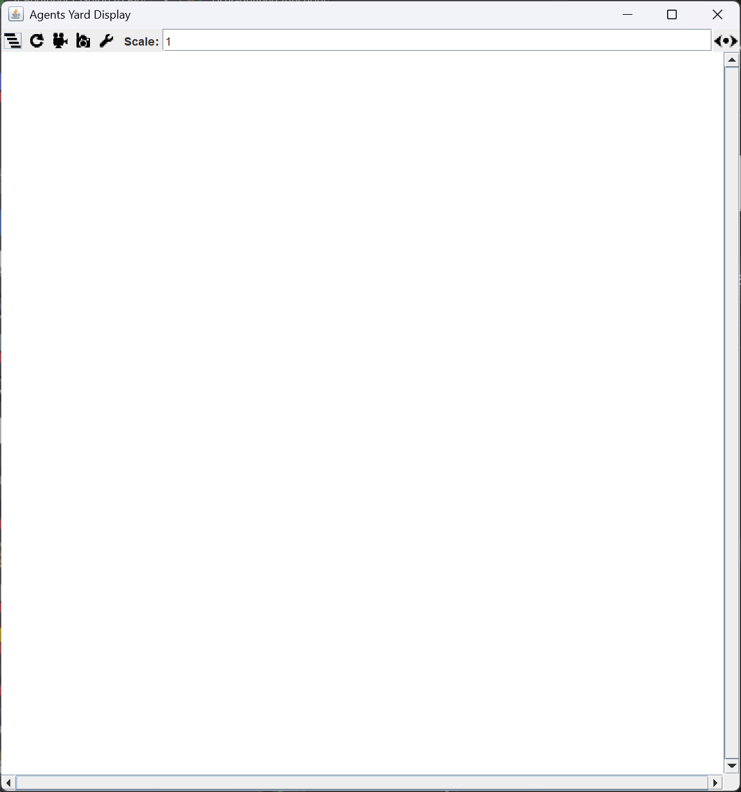
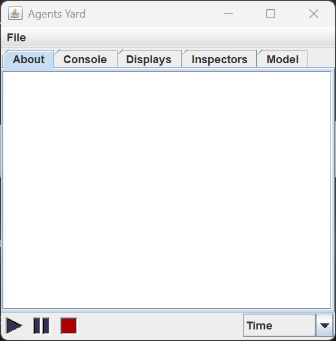
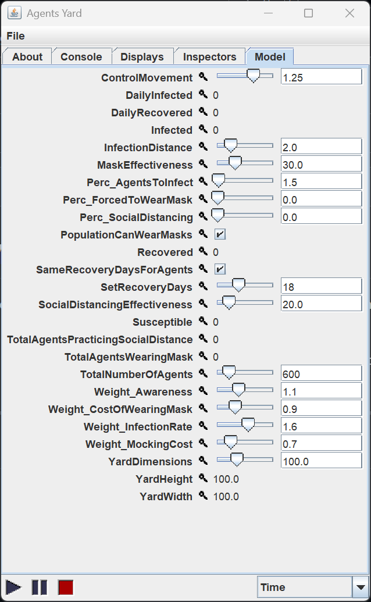

# COVID-Inspired Agent-Based SIR Model Simulation

> **A Java-based agent simulation of COVID-style disease spread and mask/social behavior using the SIR model.**



> **Agent Colors**  
> 🟦 Blue – Susceptible  
> 🔵 Dark Blue – Susceptible and wearing a mask  
> 🔴 Red – Infected  
> 🟩 Green – Recovered

This project simulates the spread of an infectious disease using the classic SIR (Susceptible-Infected-Recovered) model, extended with agent-based modeling techniques. It's built in Java using the [MASON](https://cs.gmu.edu/~eclab/projects/mason/) multi-agent simulation toolkit.

Agents represent individuals in a population who may become infected, recover, and change behavior (e.g., mask-wearing or social distancing) based on awareness, utility, and peer influence.

---

## 🧪 What Is the SIR Model?

The **SIR model** is a classic epidemiological framework used to simulate how infectious diseases spread through a population over time. It divides the population into three groups:

- **S**usceptible: Individuals who can catch the disease
- **I**nfected: Individuals who currently have the disease and can spread it
- **R**ecovered: Individuals who have recovered (or been removed) and are no longer infectious

This simulation builds on the SIR model using **agent-based modeling (ABM)** to add realistic behaviors such as:

- Mask-wearing decisions
- Social distancing
- Varying immunity and awareness levels

---

## 🧠 Features

- Simulation of disease spread using SIR dynamics
- Agents have heterogeneous immunity, awareness, and decision-making
- Mask-wearing and social distancing are dynamically adopted
- Infection probability and recovery are immunity-dependent
- Customizable parameters such as:
  - Infection radius
  - Mask effectiveness
  - Social distancing effectiveness
  - Initial infection rate
- Graphical simulation interface using MASON GUI
- Daily statistics tracking (infected, recovered, masked, etc.)


---

## 📂 How to Open and Run the Project in NetBeans

1. **Download or clone this repository**  
   - Click the green **"Code"** button > **Download ZIP**, then extract it  
   - Or use Git:  
     ```bash
     git clone https://github.com/OmarMaged3679/covid-agent-based-sir-model.git
     ```

2. **Open NetBeans IDE**

3. Go to **File > Open Project**

4. Navigate to the extracted `covid-agent-based-sir-model/` folder and open it.

5. **Add required libraries** (if needed):  
   - Right-click the project > **Properties** > **Libraries**.
   - Under the **Compile** tab, click **Add JAR/Folder...**.
   - Add all `.jar` files from the [`libraries`](./libraries/) folder:

     * `mason.21.jar`
     * `jfreechart-1.0.17.jar`
     * `jcommon-1.0.21.jar`
     * `itext-1.2.jar`
     * `bsh-2.0b4.jar`
     * `jmf.jar`
     * `portfolio.jar`

6. **Run from Source**:

    Run `ModelWithUI.java` to launch the GUI

---

## 🚀 Run Without NetBeans (Using the JAR File)

You can also run the simulation using the pre-built [`COVID-SIR-Model.jar`](./dist/COVID-SIR-Model.jar) located in the `dist/` folder.

### 🔧 Prerequisites

- Java SE Development Kit 8 or newer  
  👉 [Download JDK](https://www.oracle.com/java/technologies/javase-downloads.html)

### ▶ How to Download & Run

1. Navigate to [`dist/COVID-SIR-Model.jar`](./dist/COVID-SIR-Model.jar) in this repository.

2. On the file page:
   - Click the **"Download"** button (top-right), **or**
   - Right-click the **Raw** button and choose **"Save link as..."** to download it manually

3. Open a terminal or command prompt and run:

    ```bash
    java -jar COVID-SIR-Model.jar
    ```

Once the application launches, you'll see a window like this:

| Simulation Display | Parameter Settings |
|----------------|--------------------|
|  |  |

This is the **MASON simulation interface**, where you can view the simulation in real time and adjust parameters.

To control the simulation, use the buttons in the lower-left corner:

* ▶️ **Play** to start
* ⏸️ **Pause** to temporarily stop
* ⏹️ **Stop** to reset

---

### 🔧 Customizing Simulation Settings

Click on the **“Model”** tab (top right) to configure simulation parameters like:

- Infection radius
- Mask effectiveness
- Social distancing % and effectiveness
- Number of agents
- Weights affecting behavior (e.g., awareness, mocking cost)

> **Note:** Variables that begin with `perc_` represent percentages (e.g., `perc_ForcedToWearMask = 10.0` means 10% of agents).

Here’s what the configuration panel looks like:



All values can be adjusted before or during simulation runs.

---

## 📊 Case Studies & Live Monitoring

This simulation can be used to conduct custom case studies by adjusting parameters such as:

* Infection spread based on mask adoption or social distancing
* Utility-based decision-making under peer pressure (mocking cost)
* Immunity-based recovery timelines
* Initial population infection rates

### 🔍 Live Charting & Monitoring Demo

Here's a quick demonstration of how to enable and observe simulation charts while the model is running:


> 📝 To do this:
>
> * Click on the **Inspectors** tab
> * Use the 🔍 (magnifying glass) icon to monitor variables like `Infected`, `Recovered`, `Susceptible`, etc.
> * Charts update **live** as the simulation progresses

You can capture screenshots or record data at intervals for further analysis.

---

### ✅ Example Study Ideas

* **Mask Mandates vs. Voluntary Mask Use:** Vary `percForcedToWearMask` and compare infection curves
* **Effectiveness of Social Distancing:** Toggle `percSocialDistancing` and analyze infection suppression
* **Awareness Impact:** Change `Weight_Awareness` to test how risk awareness changes behavior outcomes
* **Cost-Benefit Tradeoffs:** Observe how increasing the `Weight_CostOfWearingMask` or `Weight_MockingCost` affects mask adoption

---

## 📚 Technologies Used

* **Java 8+**
* **MASON** (Multi-Agent Simulation Toolkit)
* **JFreeChart**, **iText** (for stats & optional exports)
* **NetBeans IDE** (recommended for dev)

---

## ✍️ Author

This project was developed as part of a simulation-based exploration of infectious disease dynamics using agent-based modeling.
* 💻 Project by: *Omar Maged*

---

## 📜 License

Licensed under the MIT License.
